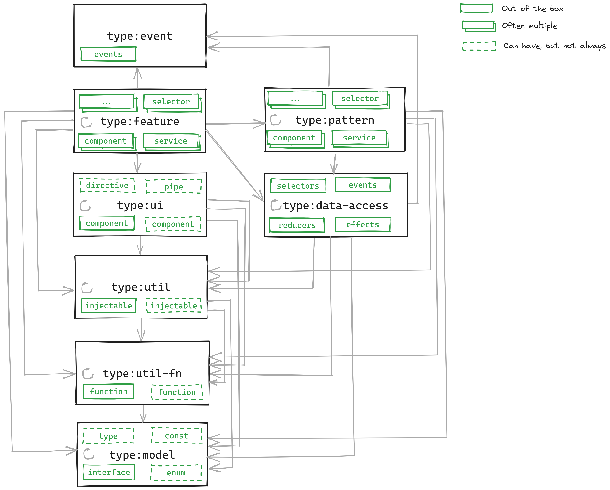
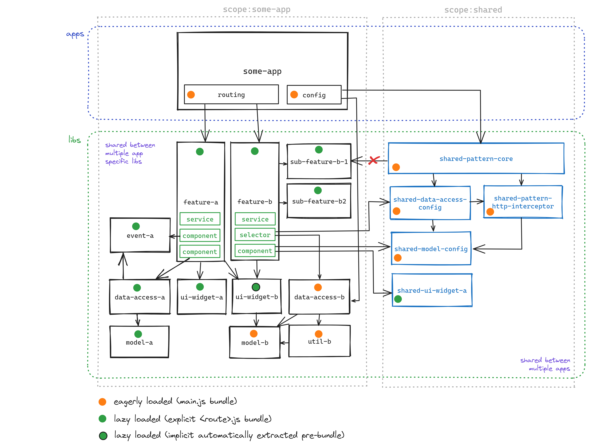
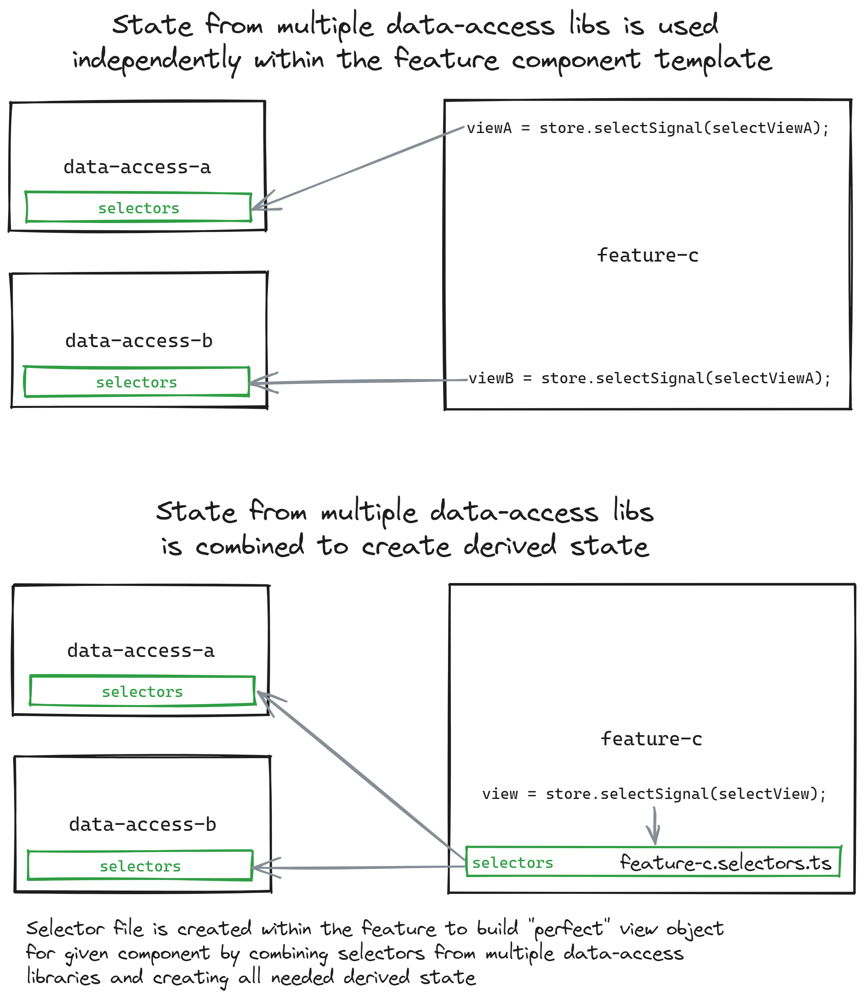

# AX Workspace

Welcome to AX  Workspace - WIP!

<!-- toc -->

- [Getting Started](#getting-started)
- [Workspace generators & Executors](#workspace-generators--executors)
- [Architecture](#architecture)
  - [Why libraries instead of "a library" ?](#why-libraries-instead-of-a-library-)
  - [Library types](#library-types)
    - [Generating of additional components, services, pipes in the libraries](#generating-of-additional-components-services-pipes-in-the-libraries)
  - [Architecture overview](#architecture-overview)
  - [Implicit dependencies](#implicit-dependencies)
    - [Assets](#assets)
    - [Styles](#styles)
  - [Project naming](#project-naming)
  - [Moving and removing of libraries](#moving-and-removing-of-libraries)
- [Customization](#customization)
  - [Generator default options](#generator-default-options)
- [NgRx Tips](#ngrx-tips)
  - [Events (actions)](#events-actions)
  - [Local selectors](#local-selectors)
- [Linting](#linting)
  - [Architecture](#architecture-1)
  - [Bundle size](#bundle-size)
  - [Angular](#angular)
    - [Typescript](#typescript)
    - [Template](#template)
  - [NgRx](#ngrx)
- [Testing](#testing)
  - [Unit testing](#unit-testing)
  - [E2e](#e2e)
- [Troubleshooting](#troubleshooting)

<!-- tocstop -->

## Getting Started

Install global `nx` CLI with `npm i -g nx` as it will make running of some commands easier.
Install the dependencies with `npm ci` (append `--legacy-peer-deps` or `--force`)

> The `--legacy-peer-deps` flag might need to used in case the dependencies available at the time of last workspace update did not fulfill their peerDependencies ranges perfectly. This might change again in the future as newer versions of the libraries are released and the `--legacy-peer-deps` flag might not be needed anymore.

## Workspace generators & Executors

This workspace provides a set of generators and executors to automate the creation of new projects and libraries
which follow desired architecture to ensure maintainability and consistency across projects in this AX workspace.

Learn more about [@ax/tooling/nx-plugin](libs/tooling/nx-plugin/README.md).

Learn more about generators and executors in general in [Nx documentation](https://nx.dev/plugins/recipes/local-generators).

## Architecture

- **Applications** are just minimal wrappers around libraries which pull together combination of application specific and shared libraries.
- **Libraries** encapsulate all the business logic and are the only place where you should be writing your code.

### Why libraries instead of "a library" ?

Using multiple libraries with predefined types and clear scopes has several advantages over a single large library
which is shared across multiple applications in a single NX workspace:

- improved long term maintainability and extensibility
- enforce clean one way dependency graph (single large lib / app tend to have unstructured internal dependencies)
- enforce separation of concerns with clear-cut roles and responsibilities with pre-defined library types
- support both "pre-packaged" (eg "core" lib) and "à la carte" (app consumes collection of lips providing basic functionality based on its unique needs) approach to library consumption from consumer applications
- visualise dependency graph

### Library types

The architecture comes with a finite set of predefined library types which
allow for clean extendable architecture while preserving enough flexibility to implement
any specific use case. Following list represents a concise summary of each library type:
(check out the [extended version](libs/tooling/nx-plugin/README.md))

- **feature** - lazy loaded feature (most custom logic will go here, eg components, services, ...)
- **pattern** - reusable pattern (eg layout, form, ...) (eager feature)
- **data-access** - headless NgRx based data access layer
- **event** - events dispatched by features / patterns (and consumed by data-access)
- **ui** - reusable UI component (eg button, input, ...)
- **util** - reusable Angular injectable utility
- **util-fn** - reusable TypeScript function utility (no Angular)
- **model** - reusable TypeScript types, interfaces, enums, consts



#### Generating of additional components, services, pipes in the libraries

Based on the above described architecture, it will only make sense to generate additional
components, services, pipes, ... in the `feature` and `pattern` libraries to implement
specific use cases.

Besides that, it can make sense to generate also

- **data-access** - additional services ...
- **ui** - additional components, directives, pipes, (usually low amount, should be tightly coupled, eg `tab-group`, `tab-header`, `tab-content`), Asle it is better to generate separate `ui` library~

In general, it is the best to use NX plugin for Intellij IDEs to generate new components, services, ... in
the desired library.

- bind the **NX Generate (UI)** to a keyboard shortcut (eg `Ctrl + Alt + Shift + S`, or anything else)
- select a folder within the desired library, eg `libs/shared/ui/tabs/src/lib`
- hit the keyboard shortcut and select `@nx/angular:component` (service, or other...)
- provide the name (the `project` field should be filled automatically because we selected folder)
- run generator

### Architecture overview



This diagrams showcases an example of a single application which consumes multiple libraries

- libraries that are scoped to the application
- libraries that are shared across multiple applications

Please notice the concept of lazy loading, in general anything which was referenced by
an eagerly loaded part of the application will be eagerly loaded as well (even if it is consumed also by a lazy feature).

This is in practice:

- things referenced by the `app.config.ts` - core state and functionality
- things referenced by the `app.component.ts` - layout, navigation, ...

Everything else should be only referenced by the lazy loaded features.

> If a library is referenced by more than one lazy loaded feature, the bundler might
> decide to extract lazy loaded "pre-bundle" which will be loaded if any of the
> lazy loaded features is loaded. This is not a problem and represents additional optimisation
> performed transparently by the bundler.

### Implicit dependencies

Some libraries like `styles` and `assets` represent implicit dependencies as they are not
referenced directly using TypeScript imports. This means that they need a little bit of
extra setup in consumer applications for them to work properly.

#### Assets

Asset libraries (images, translations, ...) have to be added in the consumer application's `project.json` file in the `targest.build.assets` array, for example...

```json
{
  "glob": "**/*",
  "input": "libs/shared/assets/i18n/src",
  "output": "assets/i18n"
},
{
  "glob": "**/*",
  "input": "libs/shared/assets/images/src",
  "output": "assets/images"
}
```

This entry will copy files from `libs/shared/assets/i18n/src` to `dist/apps/<consumer-app>/assets/i18n` folder and
from `libs/shared/assets/images/src` to `dist/apps/<consumer-app>/assets/images` folder.
We should also alwaysmake sure that such assets library is added as an implicit dependency in the `project.json` file of the consumer app in the
`implicitDependencies` array, for example...

```json
{
  "implicitDependencies": ["libs/shared/assets/i18n", "libs/shared/assets/images"]
}
```

> These libraries are added automatically if the app is generayed with `npm rung:app` but
> the existing apps (and generator) might need to be updated manually if more assets libraries
> are added.

That way, the consumer app will re-build if there was any change in the asset library.

#### Styles

Sass styles libraries have to be added to the consumer application's `project.json` file
in the `targest.build.stylePreprocessorOptions.includePaths` array, for example...

```json
{
  "includePaths": ["libs/shared/styles/theme/src", "libs/shared/styles/components/src"]
}
```

Which will then allow importing of the files in the library `src/` folder in the consumer
`*.scss` files like global `styles.scss` or components `*.component.scss` files.

```scss
@import 'theme';

h1 {
  color: $ax-theme-primary-color;
}
```

We should also always add such styles library as an implicit dependency in the `project.json` file of the consumer app in the
`implicitDependencies` array, for example...

```json
{
  "implicitDependencies": ["libs/shared/styles/theme", "libs/shared/styles/components"]
}
```

That way, the consumer app will re-build if there was any change in the asset library.

### Project naming

NX out of the box uses path in a library name so a library generated in
`libs/shared/pattern/core` will have name `shared-pattern-core`.
This will be important when referencing projects when required as parameters for CLI commands like generators
with `--project shared-pattern-core` and executors like `nx test shared-pattern-core`.

### Moving and removing of libraries

Sometimes it will make a sense to move (or rename) a library or remove it completely.
For that we should always use the `nx` commands instead of just moving or removing the library folder as
that will automate most of the adjustments that need to be performed in order for the workspace to work properly.

- `nx g remove --project <project-name>` - will remove the project and its alias from root `tsconfig.json` file
- `nx g move --project <project-name> --destination <scope>/<type>/<new-name>` - will move the project and adjust its alias from root `tsconfig.json` file

After that we should always run `npm run validate -- --fix` and perform any manual adjustments as listed in the output.

## Customization

### Generator default options

Some of the used generator options can be customized in the [nx.json](nx.json) file within the `generators` property.
This can be useful if you add additional Angular libraries which bring their own generator, and you want to customize their default options.

Additionally, default options can be evolved also for custom `@ax/tooling/nx-plugin` generators
by adjusting `libDefaultOptions` in the `libs/tooling/nx-plugin/src/generators/lib/types/<type>.ts` files
per library type.

## NgRx Tips

### Events (actions)

### Local selectors

When using NgRx, it makes sense to introduce selectors which are local to a given `feature` (or `pattern`)
instead of creating a selector which delivers perfect view for that feature as a part of the `data-access` library.

In general, there are 4 different scenarios:

1. The `feature` consumes plain state as provided by a single `data-access` library -> **`data-access` selector**
2. The `feature` consumes plain state as provided by multiple `data-access` libraries -> **`data-access` selector**
3. The `feature` consumes state as provided by a single `data-access` library, but it needs also `feature` specific derived state based on that original state which is unlikely to be useful for other features -> **local selector**
4. The `feature` consumes state as provided by a multiple `data-access` library, and it needs to combine that state in order to create derived state in a way which is unlikely to be useful for other features -> **local selector**



## Linting

### Architecture

> The architecture is validated (linted) and a lot of best practices are enforced with the help of the [Nx enforce module boundaries](https://nx.dev/core-features/enforce-project-boundaries) rule.
> as defined in the `.eslintrc.json` file in the `overrides[0].rules.@nx/enforce-module-boundaries[1].depConstraints` section.

The rules configuration is updated automatically when used `npm run g` (lib) and `npm run g:app` (app) generators.
Besides that it is always a good idea to validate if architecture and module boundaries rules are still
in sync using provided `npm run validate` generator.

This generator will make sure that

- folder structure
- project tags
- enforce module boundaries rules

are all in sync!

The reason why they can go out of sync is when we **move** or **rename** a library or an app.
In that case, we can run `npm run validate -- --fix` which will automatically update project **tags**
based on new folder structure.

Besides that it will print out if there are any conflicts between
folder structure and module boundaries rules. These conflicts than have to be resolved manually
by either renaming folders or adjusting the module boundaries rules in the `.eslintrc.json` file and scopes in `libs/tooling/nx-plugin/src/generators/lib/schema.json`.

That way we can be sure our architecture stays consistent and valid.

### Bundle size

Bundle size is linted with the help of `budgets` which are specified in the `project.json` file of each app.
These budget are evaluated on every build and if the bundle size exceeds the specified limit, the build will fail.
This is useful to prevent bundle size from growing too much, especially when not intended, for example
by incorrect import of a library or a component.

The butget based build errors can be debugged using `npm run analyze:gesuch-app` (or other apps, please add script when adding a new app)
which will provide a view of what was bundled in each bundle to figure out if something was included
by accident or if the budget needs to be adjusted.

### Angular

Angular libs are linted using the default sets specified in

- [plugin:@angular-eslint/recommended](https://github.com/angular-eslint/angular-eslint/blob/main/packages/eslint-plugin/src/configs/recommended.json)
- [plugin:@angular-eslint/template/recommended](https://github.com/angular-eslint/angular-eslint/blob/main/packages/eslint-plugin-template/src/configs/recommended.json)

(both of which are referenced through `plugin:@nx/angular` in the `.eslintrc.json` files)

Besides these presets, we also use additional rules specified in the
[.eslintrc-angular.json](.eslintrc-angular.json) file that proved to
be beneficial in our projects.

#### Typescript

- [@angular-eslint/prefer-on-push-component-change-detection](https://github.com/angular-eslint/angular-eslint/blob/main/packages/eslint-plugin/docs/rules/prefer-on-push-component-change-detection.md) - use OnPush change detection strategy by default (perf)

#### Template

- [@angular-eslint/template/button-has-type](https://github.com/angular-eslint/angular-eslint/blob/main/packages/eslint-plugin-template/docs/rules/button-has-type.md) - prevent accidental form interactions, should be `<button type="button">` in most cases
- [@angular-eslint/template/use-track-by-function](https://github.com/angular-eslint/angular-eslint/blob/main/packages/eslint-plugin-template/docs/rules/use-track-by-function.md) - `*ngFor` performance optimization (easy to add, huge impact)
- [@angular-eslint/template/no-duplicate-attributes](https://github.com/angular-eslint/angular-eslint/blob/main/packages/eslint-plugin-template/docs/rules/no-duplicate-attributes.md) - always incorrect, catch it in complex templates
- [@angular-eslint/template/no-interpolation-in-attributes](https://github.com/angular-eslint/angular-eslint/blob/main/packages/eslint-plugin-template/docs/rules/no-interpolation-in-attributes.md) - use `[prop]` instead (consistency)
- [@angular-eslint/template/no-negated-async](https://github.com/angular-eslint/angular-eslint/blob/main/packages/eslint-plugin-template/docs/rules/no-negated-async.md) - error prone, handle explicitly, eg `(stream$ | async) === false`

This additional file is referenced in the `extends` section of the
individual `.eslintrc.json` files of each library which was generated
using provided `lib` generator.

- [Docs (rules)](https://github.com/angular-eslint/angular-eslint/tree/main/packages/eslint-plugin/src/rules)
- [Docs (rules template)](https://github.com/angular-eslint/angular-eslint/tree/main/packages/eslint-plugin-template/docs/rules)

### NgRx

NgRx (data-access) libraries are linted using the default sets specified in

- [plugin:@ngrx/eslint-plugin/strict](https://github.com/ngrx/platform/blob/master/modules/eslint-plugin/src/configs/strict.ts)

This additional NgRx config is specified in the
[.eslintrc-ngrx.json](.eslintrc-ngrx.json) file is referenced in the `extends` section of the
individual `.eslintrc.json` files of `data-access` type libraries which was generated
using provided `lib` generator.

- [Docs (rules)](https://ngrx.io/guide/eslint-plugin#rules)

## Testing

### Unit testing

In general, we strive to write components with little or even NO logic at all which means
they don't really have to be tested. This is great because components are the most
complicated part of Angular application to test and those tests execute run the slowest.

Most logic is then extracted into `data-access` or `util` type libraries which are
headless and hence much easier to test.

The main product critical flows should be covered by the `e2e` tests which provide
the best tradeoff between effective / useful coverage and effort required to write them.

### E2e

You can run e2e tests in headless mode for all (`npm run e2e`) or for a specific app
(`npm run e2e:<app-name>`, these have to be added to the `package.json` file `scripts` when new app is added to the workspace).

Besides that it is also possible to serve desired app in the dev mode (eg `npm run serve:gesuch-app`)
and then start e2e tests in GUI mode with `npm run e2e:gesuch-app:open` which will start Cypress GUI.
(again, these scripts have to be added to the `package.json` file `scripts` when new app is added to the workspace).

> When writing E2E tests, always make sure to use `data-test-id="some-id"` attributes instead of
> component selectors, classes or other attributes. This way we can make sure that tests are not
> brittle and will not break when we change the component structure or styling.

## Troubleshooting

NX monorepo is a great piece of technology, but it is not perfect. Even though caching leads to great performance
it can also lead to inconsistent state, especially when removing, moving or renaming projects and files.
If you run into any issues try to run `nx reset` (or `npm run reset) and then try to run original command again.
If the problem still persists then it's most likely a real problem which than has to be solved.
